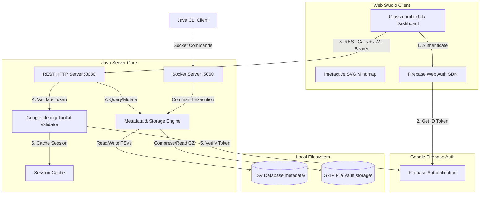

# PolyVault Studio

PolyVault is a secure, personal distributed file storage and knowledge mindmap system. It features a high-performance multithreaded Java core for socket communication and local file vaulting, combined with a modern web dashboard featuring an interactive SVG mindmap and Google Firebase security.

---

## 🏗️ System Architecture

PolyVault uses a hybrid architectural design, bridging a low-level multithreaded socket storage engine with a modern glassmorphic web portal.



### 1. Frontend Web Client (PolyVault Studio)
- **Glassmorphic Portal**: A premium, responsive interface featuring dynamic glows, custom logos, and hover transitions. Emojis have been fully replaced with crisp, custom vector SVGs.
- **Interactive Mindmap**: An SVG canvas-based knowledge graph (`graph.js`) rendering parent/child nodes using force-directed physics, custom node shapes (circles, rects, triangles, hexagons, diamonds), and dynamic status indicators (star/flame vector paths for favorite and important files).
- **Firebase Auth SDK**: Handled via modular ES6 CDN imports (`ui.js`) to provide secure Email/Password authentication, sign-ups, and Google OAuth Sign-In.

### 2. Backend Server Core (Java)
- **REST HTTP Server (`:8080`)**: Powered by `com.sun.net.httpserver.HttpServer` (`GraphApiServer.java`) to serve static assets and handle mindmap queries, node management, and file uploads/downloads.
- **Zero-Dependency Auth Interceptor**: Intercepts HTTP requests and validates the Firebase JWT ID Token directly by querying Google's secure Identity Toolkit API (`accounts:lookup`). Verified sessions are stored in a thread-safe memory cache.
- **Socket Server (`:5050`)**: Runs a multithreaded socket listener (`PolyVaultServer.java`) implementing a custom text-based communication protocol for standalone client scripts.

### 3. File Vault & Metadata Storage
- **TSV Metadata Store**: Mindmap nodes, files, and file versions are indexed under `data/metadata/` inside tab-separated values (`nodes.tsv`, `files.tsv`, `versions.tsv`), avoiding database dependencies.
- **Versioned GZIP Vault**: Files uploaded are compressed using GZIP (`GzipCompressionStrategy.java`) and stored sequentially (e.g. `v1.gz`, `v2.gz`) inside `data/storage/` for space efficiency and simple rollbacks.

---

## 📂 Data Directory Layout

```text
data/
  metadata/
    nodes.tsv        # Graph nodes (workspaces, branches, projects, notes, folders)
    files.tsv        # Associated user file metadata
    versions.tsv     # Sequenced history of file uploads
  storage/
    file-1/          # Directory matching File ID
      v1.gz          # First version (GZIP compressed)
      v2.gz          # Second version (GZIP compressed)
```

---

## 🚀 How to Run the Application

### 1. Start the Java Backend
Ensure you have JDK 22 and Maven installed, then run:

```powershell
# Compile classes
python scratch/compile.py

# Launch server
java -cp target/classes com.polyvault.App server
```

The server will initialize on ports:
- **`5050`** for Socket connections.
- **`8080`** for the REST API and static file serving.

### 2. Open the UI Studio
Open your browser and navigate to:
```text
http://localhost:8080/index.html
```

---

## 🛠️ Command-Line Interface (CLI)
You can also interact with the socket server directly using the Java CLI:

```powershell
# Create a node
java -cp target/classes com.polyvault.App client node <parent_id> <TYPE> "<name>"

# Upload a file version
java -cp target/classes com.polyvault.App client upload <path_to_file> <parent_node_id> "<title>"

# List children
java -cp target/classes com.polyvault.App client list <node_id>

# Fetch full graph JSON
java -cp target/classes com.polyvault.App client graph
```